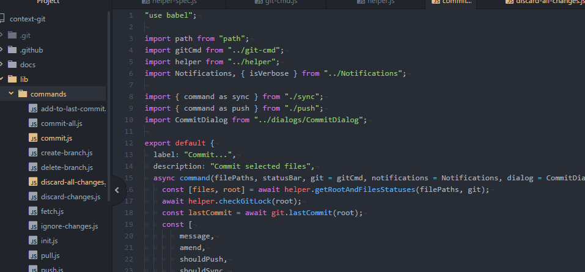

<!--  -->

# context-git package

An Atom.io package to use git from the context menu. You can choose which commands show up in the context menu by enabling/disabling them in the settings.

## Usage

This package will add a "Git" item to the context menu when you right click on the tree-view, tabs, or the editor.

## Documentation

[See /docs/docs.md](https://github.com/UziTech/context-git/blob/master/docs/docs.md)

## Contributing

### Voting

The easiest way to contribute to this package is to vote on new commmands. New commands are entered as issues with the [`command`](https://github.com/UziTech/context-git/issues?q=is%3Aissue+is%3Aopen+label%3Acommand) label. I will prioritize commands with the most :+1:'s

### Submit Commands

If there are commands you would like to see just create an issue with the command template and I will label it as a command.

### Submit An Issue

If you find a bug or just have a question about something create an issue and I will be happy to help you out.

### Create A Pull Request

If there is an issue you think you can fix or a command you think you can implement just create a pull request referencing that issue so I know that you are working on it
